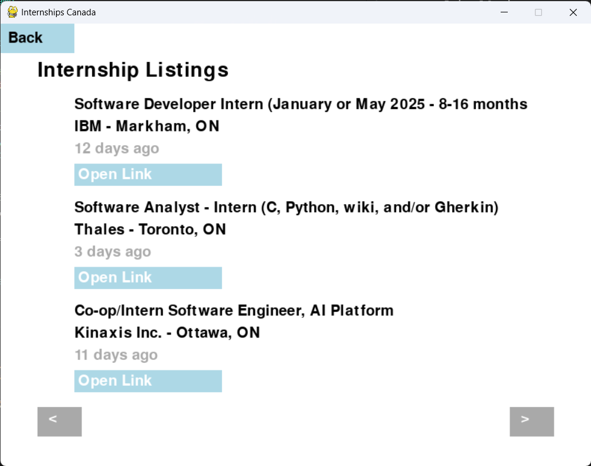

# InternshipsCanada



**InternshipsCanada** is a web scraping tool built using `scrapy` to collect internship job postings from Indeed. The spider currently scrapes for specific keywords like "intern" within designated locations in Canada, such as Ottawa.

## Features

- Scrapes job listings from Indeed based on a keyword and location.
- Parses job details such as job title, company, location, and job post age.
- Automatically paginates through search results and processes multiple job listings.
- User interface built using `pygame` to display the results in a more interactive manner.

## Project Structure

- `main.py`: Main entry point for running the application.
- `canada_1.csv`: Output data file containing the scraped job listings.
- `scraping/`: 
  - `jobscraper/`: Contains the web scraping logic.
    - `jobspider.py`: The spider built with `scrapy` to collect job postings from Indeed.
  - `venv/`: Virtual environment folder to manage dependencies.

## Requirements

- Python 3.8 or later
- Scrapy library
- Pygame

## Installation

1. Clone the repository:

    ```bash
    git clone https://github.com/yourusername/InternshipsCanada.git
    ```

2. Navigate into the project directory:

    ```bash
    cd InternshipsCanada
    ```

3. Create and activate a virtual environment:

    ```bash
    python3 -m venv venv
    source venv/bin/activate  # On Windows: venv\Scripts\activate
    ```

4. Install the dependencies:

    ```bash
    pip install scrapy
    pip install pygame
    ```
    
5. Add Scrapy API key in `scraping/jobscraper/jobscraper/settings.py`.

## Usage

1. Navigate to the `scraping/jobscraper/jobscraper` directory.
2. Run the spider:

    ```bash
    scrapy crawl indeed_jobs result6.csv
    ```

3. The scraped data will be saved into a CSV file (e.g., `result6.csv`).
4. Update file stored in csv into `canada_1.csv`.

### Running the Application

After scraping job postings, you can run the UI application to view the results.

1. Navigate to the project root directory.
2. Run the main application:

    ```bash
    python main.py
    ```

This will launch the UI for displaying and interacting with the job listings.

### Customization

You can modify the keyword and location in the `jobspider.py` file to search for different job roles or locations:

- **Keyword**: Modify the `keyword_list` in the `start_requests` method.
- **Location**: Modify the `location_list` in the `start_requests` method.

## Output

The spider collects the following data for each job posting:

- Company Name
- Job Title
- Location
- Job Posting URL
- Age of the job listing

The collected data is saved in a CSV file for easy analysis.

## License

This project is licensed under the MIT License.
